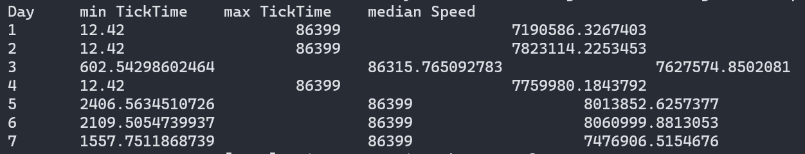

# Практика 7

## Установка зависимостей

    sudo apt-get update
    sudo apt-get install lua

    curl -L https://tarantool.io/chvkTPD/release/2.8/installer.sh | bash
    sudo apt-get -y install tarantool

    sudo apt-get install libssl-dev
    sudo tarantoolctl rocks install mqtt

## Запуск
    tarantool populate_space.lua
    tarantool analyze.lua

## Результат

